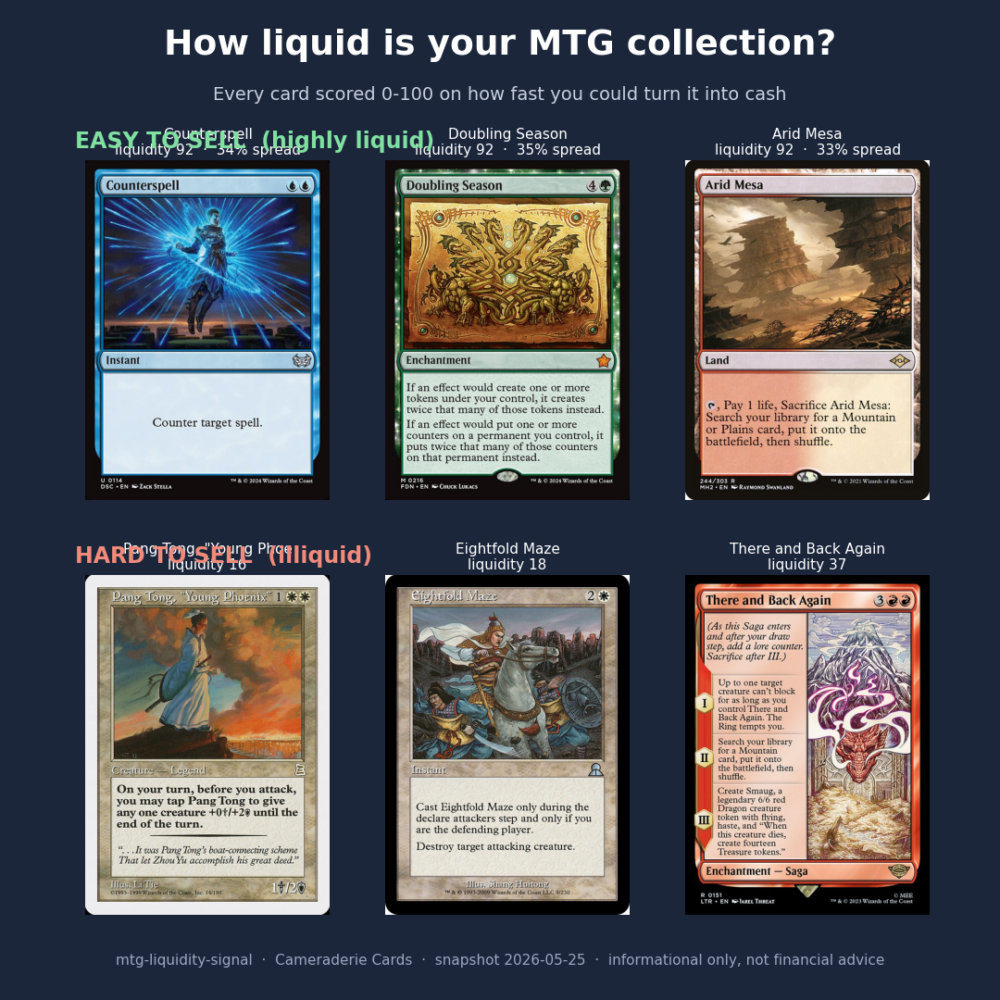

# mtg-liquidity-signal

**A Current Liquidity score for every Magic: The Gathering card: how easily you could turn it into cash.**
By Cameraderie Cards. Informational only, not financial advice.

> Part of the **Cameraderie Cards** toolkit: [`mtg-buy-signal`](https://github.com/rnorlund/mtg-buy-signal) · [`mtg-sell-signal`](https://github.com/rnorlund/mtg-sell-signal) · [`mtg-reprint-signal`](https://github.com/rnorlund/mtg-reprint-signal) · `mtg-liquidity-signal` (you are here)

Everyone asks what a card is *worth*. Almost nobody asks the harder question: could you actually
**sell it**, and how fast, and at what cost? A $200 card you cannot move is worth less to you than a
$40 card you can sell tonight. This model scores all 32,271 tracked cards from 0 to 100 on
**liquidity**: how easily an owner could convert the card to cash right now.



## What goes into the score

Four measurable signals, blended into one number:

| Signal | What it captures |
|---|---|
| **Spread** | the real bid-ask cost to round-trip a card: what a dealer pays you (CardKingdom buylist) versus what they charge, on the same printing |
| **Depth** | how many shops list the card, whether a dealer will even buy it, and how closely venues agree on price |
| **Activity** | how often the card's price actually moves over 120 days (a price that never changes means nothing is trading) |
| **Demand** | how wanted the card is in Commander, the format that drives most secondary-market trading |

A card scores high only when it is cheap to exit, sold in many places, actively repricing, and
wanted.

## What it looks like

The most liquid cards are exactly the ones you would expect: heavily played eternal and Commander
staples that sell in minutes at a known price.

| Card | Liquidity | Spread | Venues |
|---|---|---|---|
| Counterspell | 92 | 34% | 4 |
| Doubling Season | 92 | 35% | 4 |
| Arid Mesa | 92 | 33% | 4 |
| Rhystic Study | 91 | 40% | 4 |
| Sol Ring | 81 | 50% | 4 |

At the other end sit expensive but thin-market cards: pieces like *Pang Tong, "Young Phoenix"* from
Portal Three Kingdoms carry a high price tag but almost no dealer will quote a fair buy price on a
given day, and they list in only one or two places. High price and easy sale are not the same thing.

See [`TechnicalPaper/REPORT.md`](TechnicalPaper/REPORT.md) for the full methodology, validation, and
limitations.

## The predictions

[`outputs/liquidity_signal.csv`](outputs/liquidity_signal.csv) is the deliverable, one row per card:

| field | meaning |
|---|---|
| `liquidity_rank` | 1 = most liquid (global rank) |
| `oracle_id` | Scryfall oracle id (stable join key) |
| `name` | English card name |
| `price` | reference market price at scoring time |
| `liquidity_score` | 0-100 Current Liquidity score |
| `bucket` | Highly liquid / Liquid / Slow / Illiquid |
| `spread_pct` | measured CardKingdom bid-ask spread (blank if no dealer bid) |
| `n_providers` | how many retail venues list the card |
| `has_buylist` | whether a dealer publishes a buy price |
| `spread_score`, `depth_score`, `activity_score`, `demand_score` | the four sub-scores |
| `is_imputed` | true when there is no dealer bid, so the spread is estimated |

## How it is validated

This is **version 1: a transparent composite index, not a black-box forecast**. There is no public
record of "how many days each card took to sell", so it does not claim a held-out accuracy number.
Instead it is checked two honest ways (both in the technical report):

1. **The buckets line up with reality.** Cards the index calls illiquid really do cost more to
   round-trip. Median measured spread runs from about 50% for the Highly liquid bucket up to 97% for
   the Illiquid bucket.
2. **Independent signals agree (the real test).** If we rank cards using only depth, activity, and
   demand and deliberately leave the spread out, the measured spread still falls steadily as that
   spread-free score rises (rank correlation about 0.44). Signals that never saw the spread predict
   the spread.

## Dated, falsifiable track record

[`track_record/`](track_record/) holds dated, immutable snapshots of past predictions, each with a
SHA-256 manifest so anyone can confirm later that we did not quietly rewrite history.

## What's in this repo (and what isn't)

| Open here | Held private |
|---|---|
| Methodology + technical report (PDF / DOCX / Markdown) | Data pipeline and feature code |
| Predictions (CSV / JSON) | Raw price-history data (licensed) |
| Validation outputs and figures | Daily refresh infrastructure |

## Honest limitations

- No true traded-volume or listing-count data is used yet. Spread, price staleness, and venue
  breadth stand in for market depth and trading velocity; a future version will add real listing
  counts and sales velocity.
- Dealer-bid coverage is CardKingdom-only and United States centric. Cards without a dealer bid have
  an estimated spread, flagged `is_imputed`.
- Collectible markets are genuinely illiquid with wide spreads. Making that cost visible is the whole
  point of this tool.

## Disclaimer

See [`DISCLAIMER.md`](DISCLAIMER.md). Short version: this is a model estimate of how easily a card
could be sold, not a price forecast and not investment advice.

## Citation

```
Cameraderie Cards. mtg-liquidity-signal: a Current Liquidity index for
Magic: The Gathering cards. 2026. https://github.com/rnorlund/mtg-liquidity-signal
```

## Sibling repositories

| Repo | Question it answers |
|---|---|
| [`mtg-buy-signal`](https://github.com/rnorlund/mtg-buy-signal) | Which cards are likely to spike upward, when to **buy** |
| [`mtg-sell-signal`](https://github.com/rnorlund/mtg-sell-signal) | Which cards have peaked and are likely to fall, when to **sell** |
| [`mtg-reprint-signal`](https://github.com/rnorlund/mtg-reprint-signal) | Which cards are at risk of being reprinted, when to **brace** |
| `mtg-liquidity-signal` | How easily a card can be turned into cash, **can you actually sell it** |

## License

[CC BY-NC-SA 4.0](LICENSE) on the methodology, report, and predictions data. Commercial use,
redistribution of the prediction stream, or training a derivative model on these outputs is not
permitted without a license.
