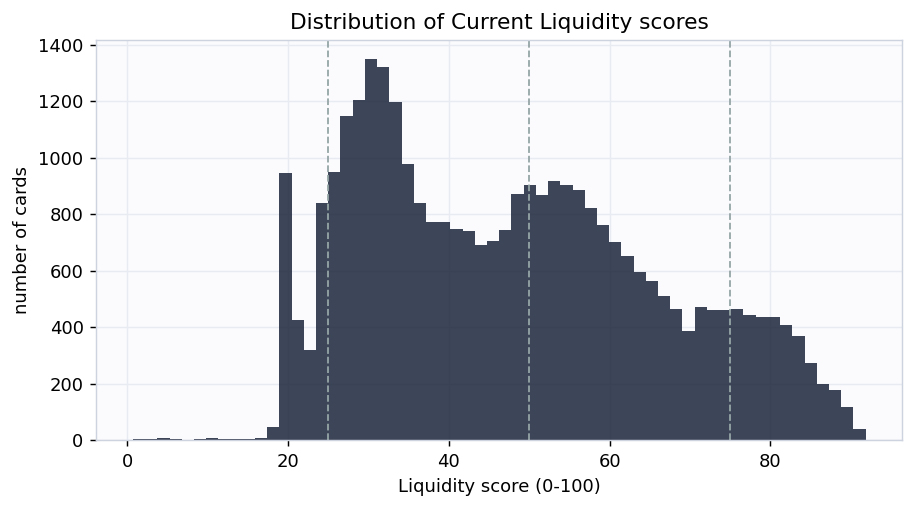
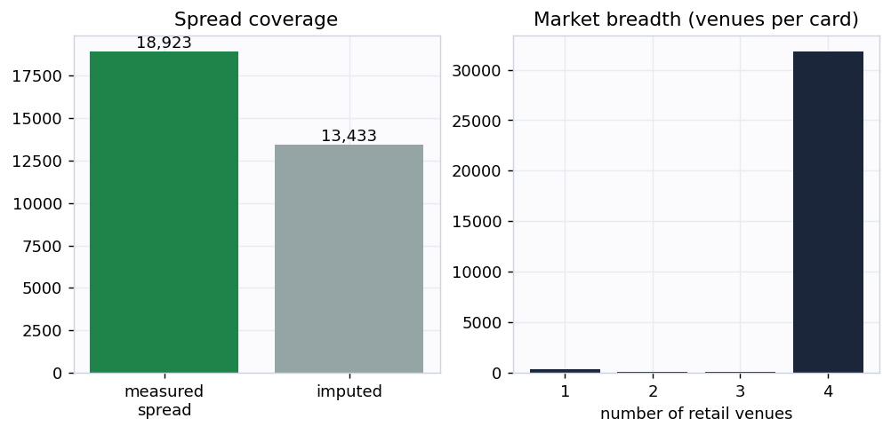
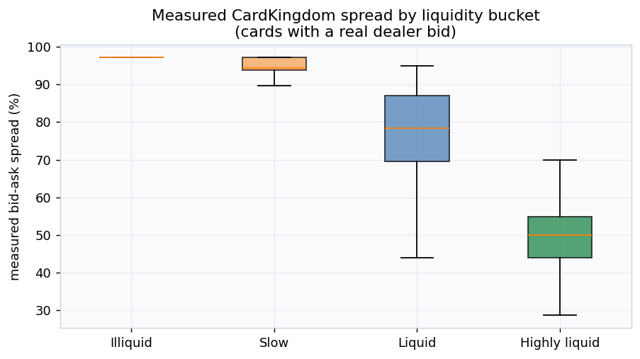
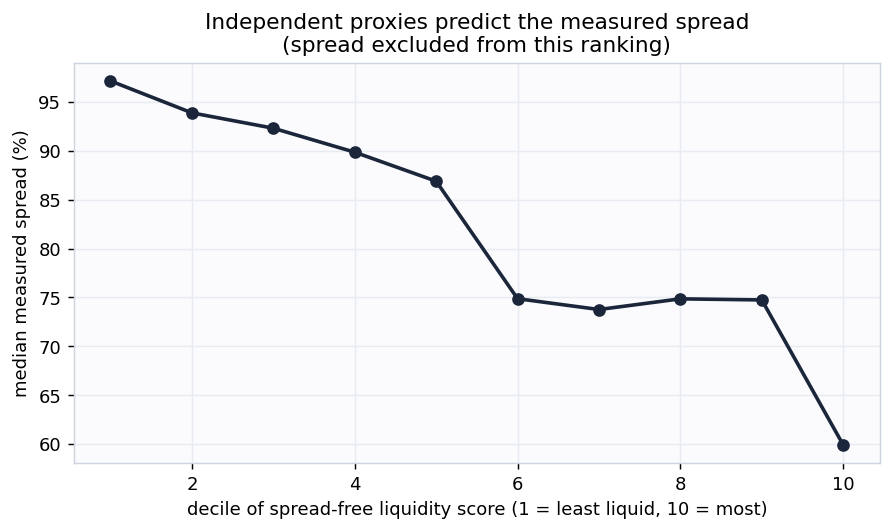
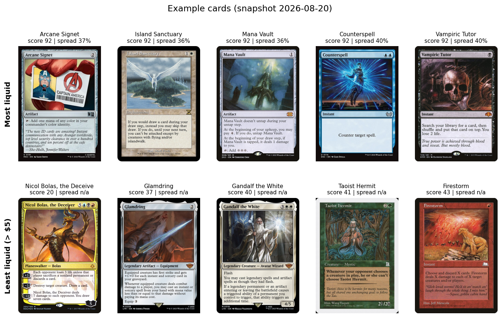

# mtg-liquidity-signal: the Current Liquidity index

**Snapshot 2026-08-20. By Cameraderie Cards. Informational only, not financial advice.**

Every existing model in this toolkit tells you *direction*: will a card rise (buy), has it peaked
(sell), is it about to be reprinted (brace). None of them tells you whether you can actually
**exit**. A perfect sell call is worthless on a card that takes months to move and only at a deep
discount. This model fills that gap. It assigns every Magic: The Gathering card a **Current
Liquidity** score from 0 to 100: how easily an owner could turn it into cash right now.

## What goes into the score

Liquidity is built from four measurable proxies, each normalized to a percentile and blended
(weights {'spread': 0.4, 'depth': 0.25, 'activity': 0.2, 'demand': 0.15}):

| Component | What it measures | Source |
|---|---|---|
| Spread | bid-ask cost to round-trip, CardKingdom buylist vs retail on the same printing | multi-venue price feed |
| Depth | how many venues list the card, whether a dealer will buy it, cross-venue price agreement | multi-venue price feed |
| Activity | how often the quoted price actually moves over 120 days (a flat price means nothing is trading) | 16-year daily history |
| Demand | Commander-format popularity (EDHREC) | EDHREC |

A card scores high only when it is cheap to exit, sold in many places, actively repricing, and
wanted. The weights lean on the spread because that is the cost an owner actually pays to sell.

## Coverage

Scored **32,346 cards** at this snapshot. **18,566** of them have a
real dealer bid (CardKingdom buylist), so their spread is **measured**, not estimated; the median
measured spread is **86.8%**. Cards without a dealer bid are flagged
`is_imputed` and scored from depth, activity, and demand only.

## Does the score mean anything? Two honest checks

**1. Measured spread lines up with the buckets.** Cards the index calls illiquid really do cost
more to round-trip. Because the spread is one input to the score, this is partly a consistency
check rather than a clean test.

**2. Independent proxies predict the spread (the real test).** If we rank cards using *only* depth,
activity, and demand and deliberately **exclude the spread**, the measured spread still falls
steadily as that spread-free score rises (rank correlation **0.461**). The
proxies that never saw the spread agree with the spread. That is genuine corroboration, not
circular reasoning.

## Example cards

The most liquid cards are heavily played eternal and Commander staples that sell in minutes at a
known price. The least liquid expensive cards are thin-market oddities: no dealer will quote a buy
price, and they list in only one or two places.

## Buckets

| Bucket | Score | Cards | Median measured spread |
|---|---|---|---|
| Highly liquid | 75-100 | 3,391 | 49.9% |
| Liquid | 50-75 | 10,869 | 78.4% |
| Slow | 25-50 | 15,458 | 94.3% |
| Illiquid | 0-25 | 2,628 | 97.1% |

## How this plugs into the other signals

Liquidity is a multiplier on every other call. It converts "should I sell" into "can I sell, how
fast, at what cost," and it filters out illiquid buy candidates the spike model would otherwise
flag. In the toolkit's risk-adjusted value equation, the expected value of a position is discounted
by its spread and expected time-to-sale to get a **net realizable** value.

## Honest limitations

- This is **version 1: a composite proxy index, not a supervised forecast**. It does not carry a
  held-out AUC because there is no public ground-truth label for "days to sale."
- There is **no true traded-volume or listing-count data yet**. Spread, price staleness, and venue
  breadth are stand-ins for depth and velocity. The roadmap adds TCGplayer listing counts and sales
  velocity (the printing table already carries the join key), which will replace the proxies with
  measured depth.
- Buylist coverage is CardKingdom-only and United States centric. Cards without a CardKingdom bid
  have an imputed spread and should be read with that caveat.
- Informational only, not financial advice.

Generated by <code>scripts/build_report.py</code> from
<code>data/processed/liquidity_features.parquet</code>.

